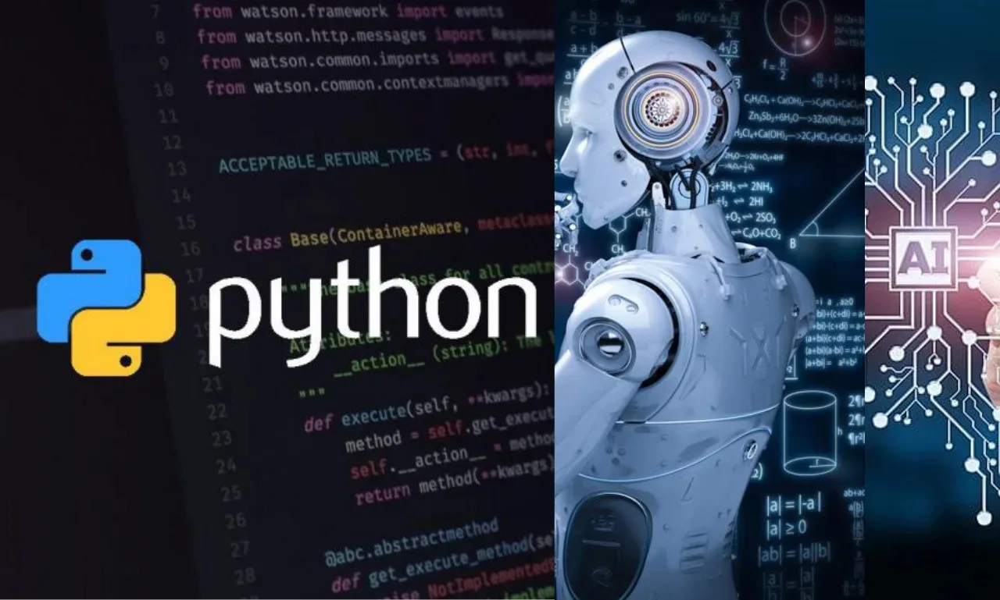
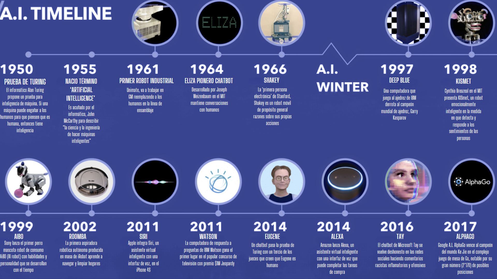

# Bienvenidos al taller de Python e IA

  
  

## Introduccion a Inteligencia Artificial:
 La inteligencia artificial es un campo de la ciencia relacionado con la creación de computadoras y máquinas que pueden razonar, aprender y actuar de una manera que normalmente requeriría inteligencia humana o que involucre datos cuya escala exceda lo que los humanos pueden analizar. 

## Linea de tiempo de Inteligencia Artificial

  
  

## Tipos de Ingeligencia Artificial
#### IA basada en reglas :
IA basada en reglas (Symbolic AI): También conocida como IA basada en conocimiento, este enfoque utiliza reglas lógicas para representar el conocimiento y realizar razonamiento sobre él. Se basa en la manipulación de símbolos y estructuras de datos formales.
#### IA de aprendizaje automático (Machine Learning, ML)
IA de aprendizaje automático (Machine Learning, ML): Se centra en desarrollar algoritmos y modelos que permiten a las computadoras aprender patrones y tomar decisiones a partir de datos sin ser explícitamente programadas para cada tarea.
#### IA profunda (Deep Learning)
IA profunda (Deep Learning): Es una subcategoría del aprendizaje automático que utiliza redes neuronales artificiales con múltiples capas para aprender representaciones de datos con múltiples niveles de abstracción. Es especialmente efectiva en tareas como el reconocimiento de imágenes y de voz, y el procesamiento del lenguaje natural.
#### IA simbólica
IA simbólica: Se basa en la manipulación de símbolos y en la lógica para representar el conocimiento y tomar decisiones. Se utiliza en áreas como el razonamiento automatizado y los sistemas expertos.
#### IA cognitiva
IA cognitiva: Se centra en imitar el proceso de pensamiento humano, incluidas las capacidades de percepción, comprensión del lenguaje, razonamiento y resolución de problemas.
#### IA de refuerzo (Reinforcement Learning)
IA de refuerzo (Reinforcement Learning): Los agentes aprenden a tomar decisiones a través de interacciones con un entorno, maximizando las recompensas y minimizando las penalizaciones.
#### IA generativa
IA generativa: Se enfoca en la generación de datos nuevos y originales, como imágenes, música, texto, entre otros.
#### IA híbrida
IA híbrida: Combina diferentes enfoques de IA, como el aprendizaje automático y la IA simbólica, para aprovechar las fortalezas de cada uno en diversas aplicaciones.
## Principales aplicaciones tecnicas de Inteligencia Artificial
#### Asistentes personales virtuales
#### Climáticas
#### Finanzas
#### Agricolas
#### Logistica y transporte
#### Comercial
#### Educacion
#### Sanidad
## Ejemplos en vivo:
### Modelo Machine Learning
### Conectandonos a IA Generativa(Openai)
### Extra crea tu Openai Key:
[Tutorial](https://github.com/NehuenGyL/Taller_IA/blob/main/Tutorial.md)

[Recursos](https://github.com/NehuenGyL/Taller_IA/blob/main/Recursos.md)
## Créditos
Desarrollado por:

| Nombre | LinkedIn  |
|--------|-----------|
| Nehuén González   | [LinkedIn](https://www.linkedin.com/in/nehuen-gonzalez/) |
| Ariel Romero  | [LinkedIn](https://www.linkedin.com/in/ariel-w-romero/) |
