# Bienvenidos al tutorial de Openai

  
  

## Introduccion a creacion de cuenta:

Si estás interesado en integrar la inteligencia artificial de OpenAI en tus proyectos , necesitarás generar una API Key. Esta clave es esencial para acceder a la API de OpenAI y hacer consultas a su modelo de lenguaje natural, GPT-3/4 . En este artículo, te explicaremos cómo consultar las API Keys generadas en la consola de OpenAI, paso a paso.

## Primero que nada ¿Qué son las API Keys?

Antes de empezar, es importante entender qué son las API Keys. Una API Key es una clave que te identifica y autentica ante la API de un servicio. En el caso de OpenAI, la API Key te permite hacer consultas a su modelo de lenguaje natural, GPT-3/4. Sin ella, no podrás acceder a la API ni hacer consultas al modelo.

## Paso 1: Crear una cuenta de OpenAI
Lo primero que debemos hacer es crear una cuenta, para esto ingresa a la ventana de registro de OpenaAI siguiente [enlace](https://chat.openai.com/auth/login?ref=tenten-she-ji-zhou-bao)

## Paso 2: Registrarse
Ahora debes hacer clic en el enlace Registrarse:

  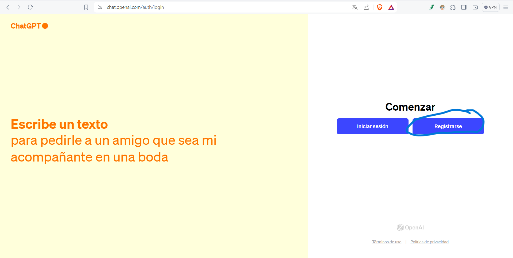
  

Después introduce tu correo en ChatGPT y haz clic en «Continuar»

  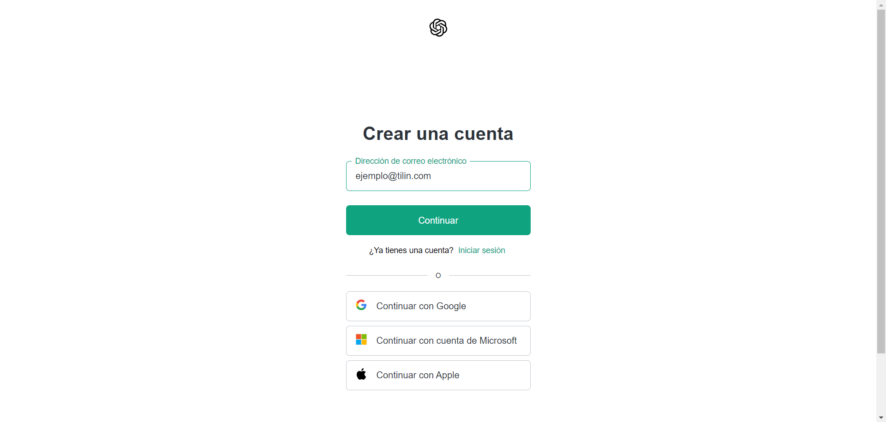
  

El siguiente paso es colocar una contraseña, normalmente son 12 caracteres para mayor seguridad, luego haz clic en «Continuar»

  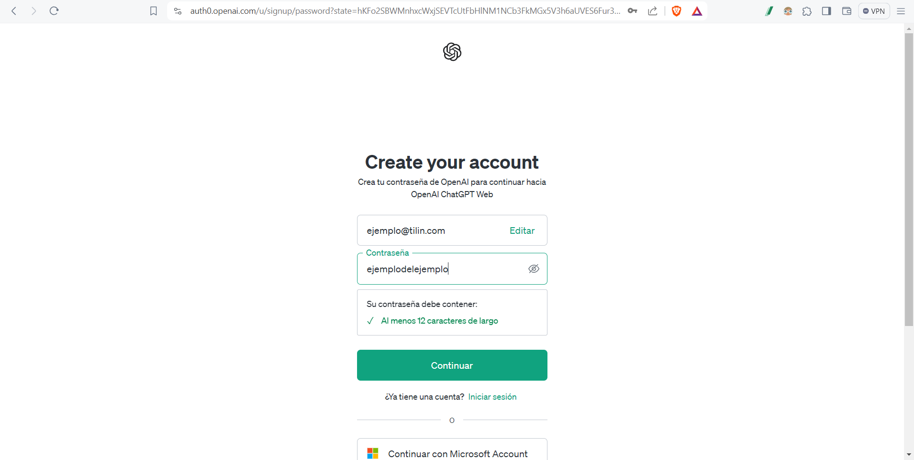
  

Una vez creada la cuenta te va a solicitar que verifiques tu correo electronico por una cuestion de seguridad:

  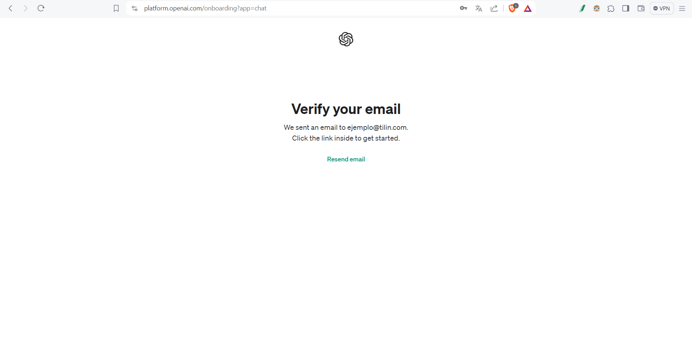
  

## Paso 3: Obtener un API Key

Para obtener las API Keys en la consola de OpenAI, debes seguir los siguientes pasos:
Ingresa a [link](https://platform.openai.com/account/api-keys)

Una vez dentro de la organización, dirígete a la sección "API Keys"

  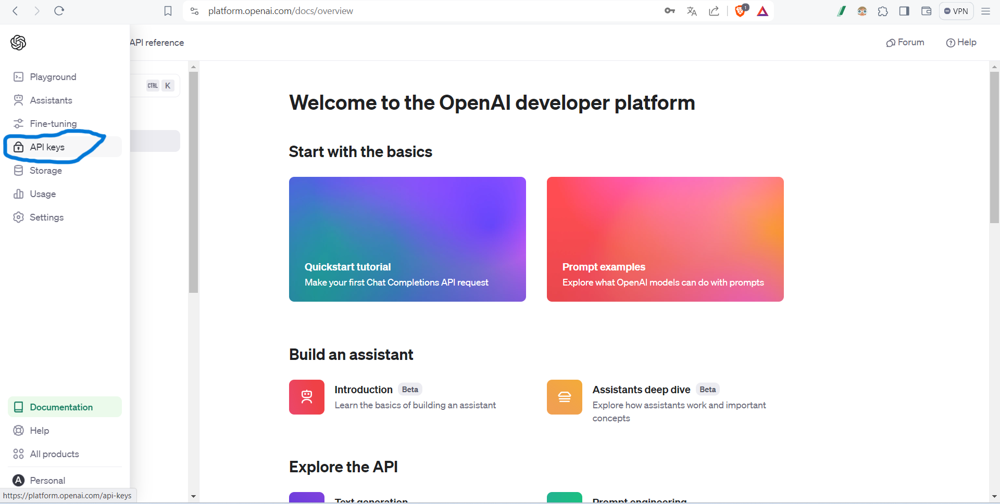
  

Haz clic en el botón "Create new API key".

  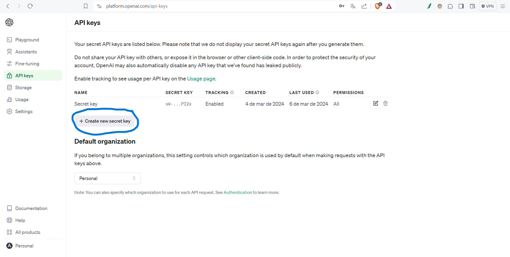
  

  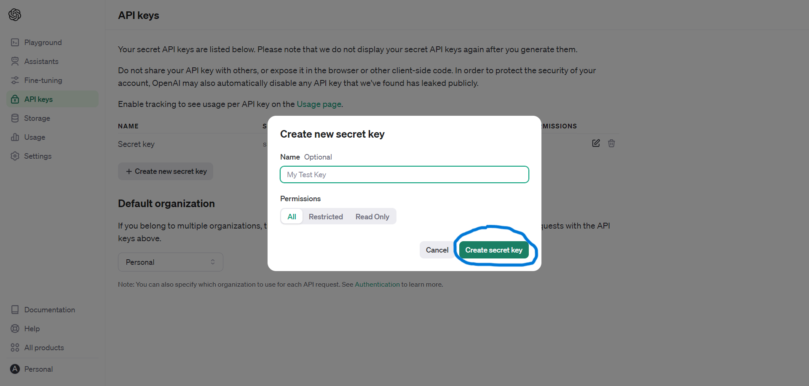
  

Aparecerá una ventana con la clave de acceso. Es importante que guardes esta clave en un lugar seguro, ya que no podrás verla nuevamente.

  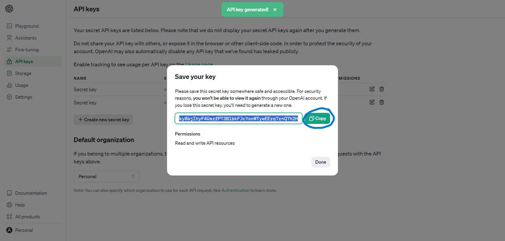
  

Utiliza esta clave en tus solicitudes a la API de OpenAI para autenticarte y obtener acceso a los recursos disponibles.

  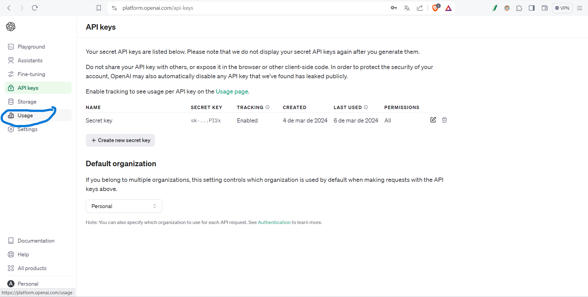
  

## Paso 4: Verificar costos

Si necesitas verificar tus costos puedes ir a la seccion "Usage"

  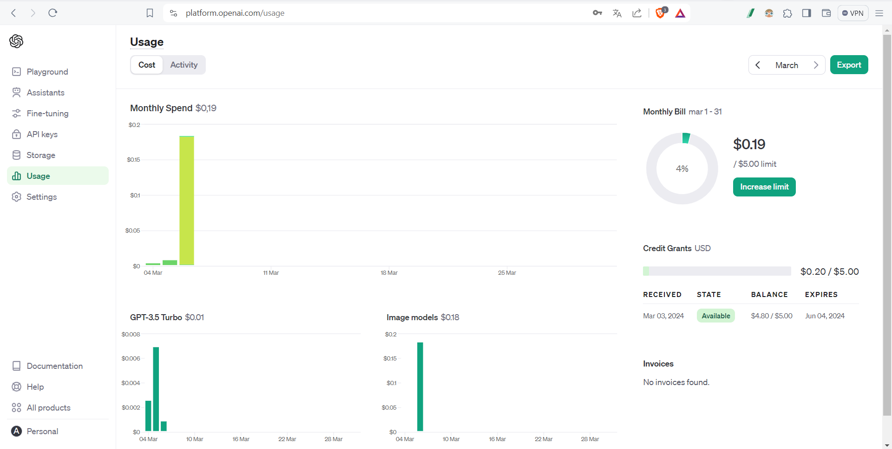
  

## Paso 5: Crear una variable de entorno 

Normalmente podriamos crear una variable siempre que querramos usar la API KEY de OpenAI pero les brindamos una solucion que podria facilitar mucho su experiencia de usuario

Primero que nada vamos a ir a "busqueda" en nuestro computador y vamos a escribir "variables de entorno"
Y seleccionamos "Editar las variables de entorno del sistema"

  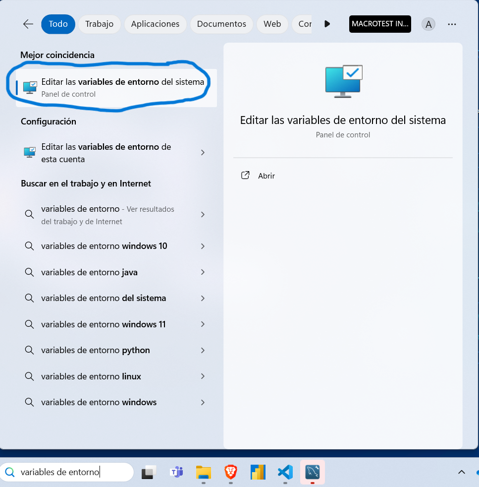
  

Luego se abre una pestaña y seleccionamos "variables de entorno"

  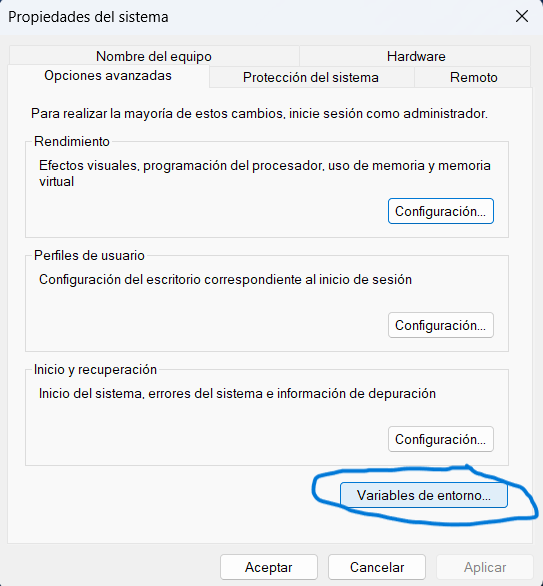
  

Se abre otra nueva pestaña y seleccionamos en Variables de entorno de usuario "Nuevo"

  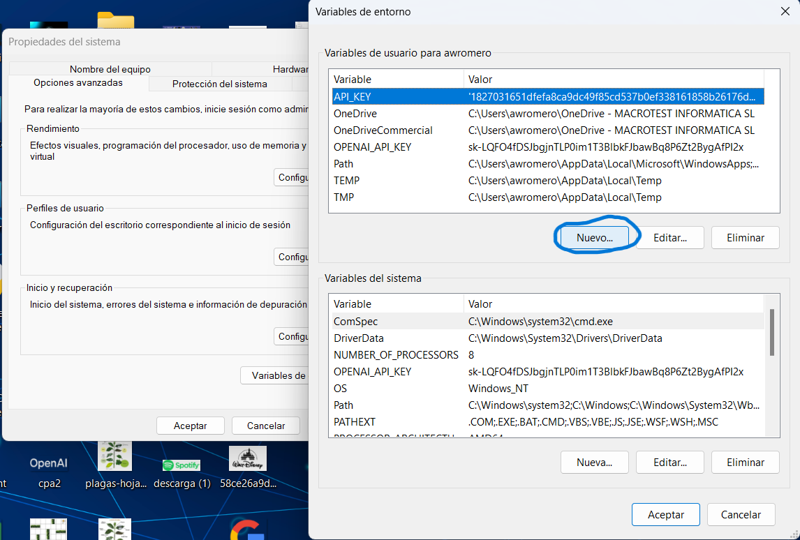
  

Le colocamos el nombre de la variable que seria OPENAI_API_KEY, y pegamos la API KEY que obtuvimos de OpenAI

  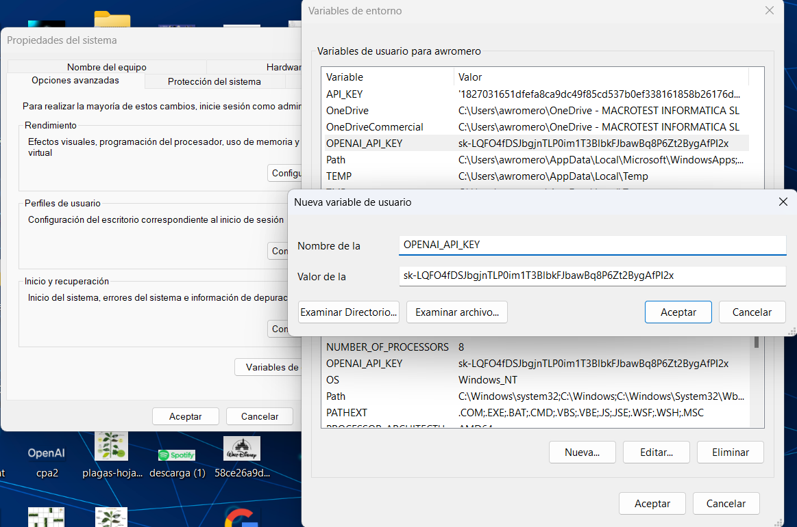
  

### Estos pasos se repiten en Variables de sistema

  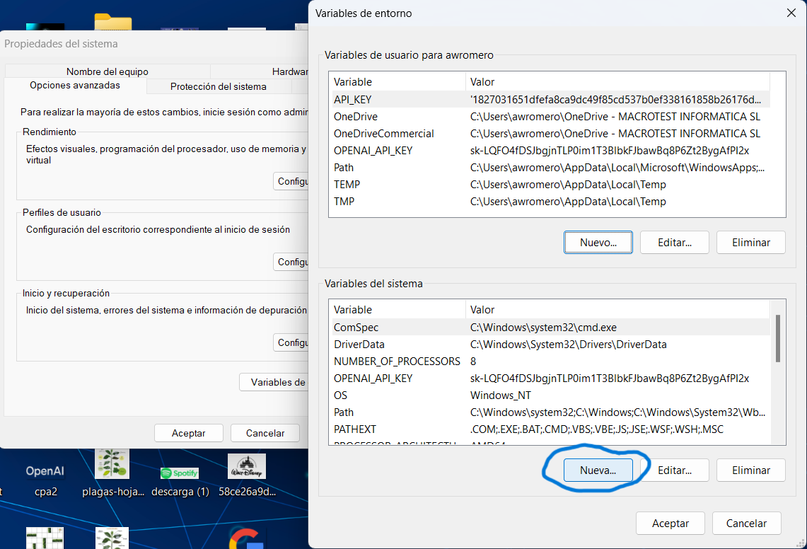
  

  
  

### Y todo listo para poder probar la IA de OpenAI para tus proyectos

  
  

